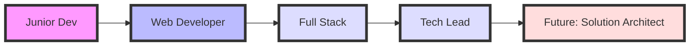

<div align="center">
  
</div>

<div align="center">
  
</div>

# 🌟 Selamat Datang di Profile GitHub Saya! 

> _"Kode adalah puisi dalam bahasa komputer. Mari kita ciptakan masterpiece bersama!"_ 🎨

<div align="center">
  
  
  
</div>

## 🎭 Persona Digital

```javascript
const syawalProfile = {
    nama: "Syawa Mods",
    title: "Full Stack Developer Extraordinaire",
    lokasi: "🇮🇩 Indonesia",
    passion: ["Coding", "Problem Solving", "Innovation"],
    quotes: "Transformasi digital dimulai dari kode yang bersih",
    superpower: "Mengubah kopi menjadi kode ☕→💻",
    misi: "Menciptakan solusi teknologi yang membawa dampak positif"
};
```

## 🚀 Journey Profesional Saya



## 💫 Expertise & Tools

### 🎯 Primary Stack
<div align="center">
  
</div>

### 🛠️ Development Arsenal
<div align="center">
  <table>
    <tr>
      <td><strong>Category</strong></td>
      <td><strong>Technologies</strong></td>
    </tr>
    <tr>
      <td>Frontend Magic ✨</td>
      <td>
        
        
        
      </td>
    </tr>
    <tr>
      <td>Backend Power 💪</td>
      <td>
        
        
      </td>
    </tr>
    <tr>
      <td>Database Masters 🎲</td>
      <td>
        
        
      </td>
    </tr>
    <tr>
      <td>DevOps & Cloud ☁️</td>
      <td>
        
        
        
      </td>
    </tr>
  </table>
</div>

## 📊 GitHub Statistics

<div align="center">
  
</div>

<div align="center">
  
  
</div>

<div align="center">
  
</div>

## 🏆 Achievements & Certifications

<div align="center">
  
</div>


## 🎯 Project Showcase

### 💼 Portfolio Highlight
<div align="center">
  <table>
    <tr>
      <th>Project</th>
      <th>Tech Stack</th>
      <th>Highlights</th>
    </tr>
    <tr>
      <td>
        <strong>🎓 Siswa Diklat</strong><br>
        <a href="https://github.com/syawal121008/siswa_diklat">
          
        </a>
      </td>
      <td>
        
        
        
      </td>
      <td>
        - 📈 1000+ Active Users<br>
        - 🚀 99.9% Uptime<br>
        - ⚡ Lightning Fast Performance
      </td>
    </tr>
    <tr>
      <td>
        <strong>🛒 E-Commerce Platform</strong><br>
        <a href="#">
          
        </a>
      </td>
      <td>
        
        
        
      </td>
      <td>
        - 💳 Multiple Payment Integrations<br>
        - 📱 Responsive Design<br>
        - 🔒 Advanced Security Features
      </td>
    </tr>
  </table>
</div>

## 📱 Connect With Me

<div align="center">
  <a href="syawalbotz5@gmail.com">
    
  </a>
  <a href="https://wa.me/6288225715139">
    
  </a>
  <a href="https://instagram.com/s.y.a.w.a.l_2008">
    
  </a>
  <a href="https://github.com/syawal121008">
    
  </a>
</div>

## 🎯 Current Focus

```javascript
const currentFocus = {
    belajar: [
        "🎯 Architecture Patterns",
        "☁️ Cloud Native Development",
        "🤖 AI Integration in Web Apps",
        "📱 Progressive Web Apps"
    ],
    project: [
        "🚀 Scaling Microservices",
        "📊 Data Analytics Platform",
        "🌐 Open Source Contributions"
    ],
    goals2024: {
        technical: "Master System Design & Architecture",
        personal: "Contribute to Major Open Source Projects",
        community: "Share Knowledge through Tech Talks"
    }
};
```

## 🎵 Spotify Playing

<div align="center">
  
</div>

---

<div align="center">
  
</div>

<div align="center">
  <strong>🚀 Let's create something amazing together! 🌟</strong>
</div>
